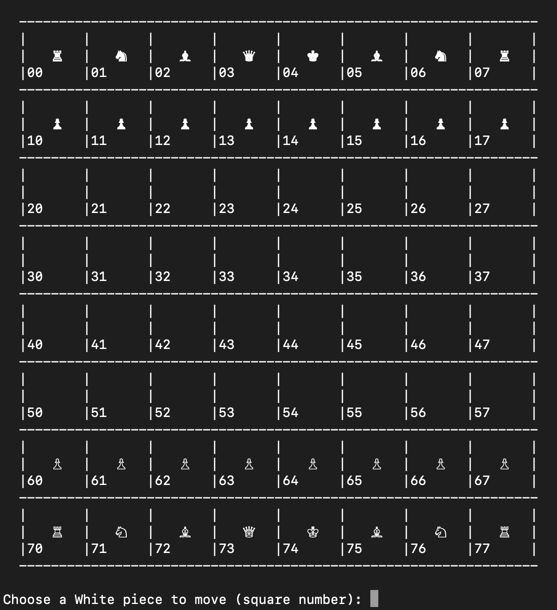

This is chess in the terminal. It's meant for two human players to play, head-to-head.
There is no computer opponent. Written in Python 3.

To run in your terminal:
`python3 main.py`

The game will then kick off a series of prompts until complete.

To exit the game early, type `control-c`.

Copyright 2020 Phil Spitzer
